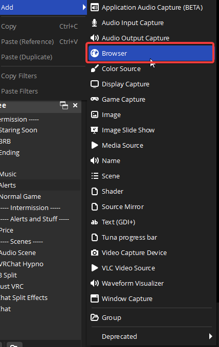
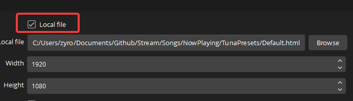

# TunaPresets
 Tuna OBS for displaying current song (Presets)

## Setup

Download and install [Tuna](https://obsproject.com/forum/resources/tuna.843/) 
https://obsproject.com/forum/resources/tuna.843/

Make sure this setting is on

and on the obs side make a new browser source

then choose to have it as a local file and locate the style you want

then click browse and locate the style you want in my example I choose the default.

