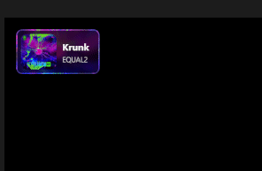
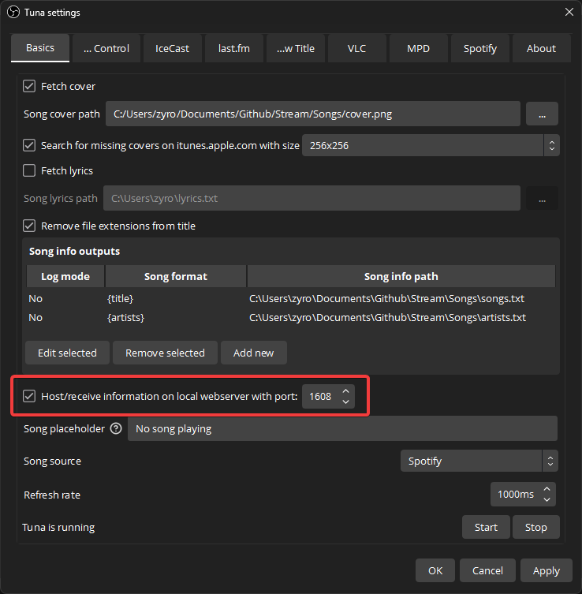

# TunaPresets
 Tuna OBS for displaying current song (Presets) 

## [Use the URL Builder](https://maikatura.github.io/TunaPresets/StringBuilder.html)

### Styles

| Style | Position | URL | 
| --- | --- | --- |
| Default | Top Left | https://maikatura.github.io/TunaPresets/Default.html |

### Animations

| Animation Name | Description |
| --- | --- |
| Default | Scales down to 0, then changes, then back to 1 in scale |
| UpAndDown | Goes up first to change then down |
| DownAndUp | Goes down first to change then up |

To add another animation then the default use `?animation=[animation type]` so a custom animation url should look like this 
`https://maikatura.github.io/TunaPresets/Default-TopLeft.html?animation=UpAndDown` 

| Position Name | Description |
| --- | --- |
| TopLeft | Scales down to 0, then changes, then back to 1 in scale |
| BottomLeft | Goes up first to change then down |
| TopRight | Goes down first to change then up |
| BottomRight | Goes down first to change then up |

### Setup

Download and install [Tuna](https://obsproject.com/forum/resources/tuna.843/) 
https://obsproject.com/forum/resources/tuna.843/

Make sure this setting is on

and on the obs side make a new browser source and add any of the templates above!